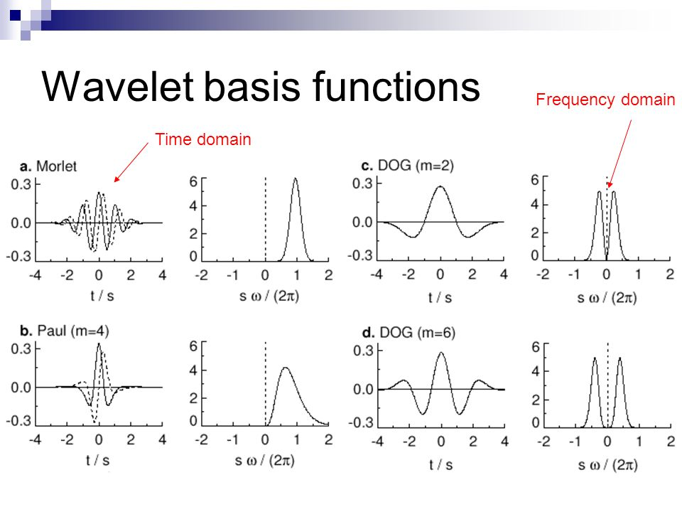

# Module3
## Module3.1 Convolutional Neural Networks
#### Question1. normalized scale 중 중간 중간에 shuffle을 하는데, sequence data이다보니 처음에는 shuffle은 안해야 하는게 정상이 아닌가 하는 생각을 해봤습니다. 지금 하는게 좋은것인지 잘 모르겠습니다.

    해당 질문에 답변을 드리자면, shuffle은 모든 sequence를 생성한 이후에 일어나기 떄문에
    투자 시기에 관계없이 performance가 나오도록 하는 모델의 일반화에 도움이 됩니다.
    그런데 만약에 투자 시기 또한 중요한 요인이라 local time에 대한 모델이 맞다고 생각하시면, shuffle 자체가 적절하지 않을수도 있습니다. 
    이 부분은 추가적인 테스트가 필요한 부분이고요.

#### Question2. deque() 동작은 이해하겠는데 왜 해야하는지 잘 모르겠습니다.

    deque는 maxlen을 설정하여 time 기준의 sequence 데이터를 생성할 수 있는데 간편한 구조를 제공합니다.

#### Question3. buy data와 sell data 수량을 동일하게 가져갔습니다. 한쪽으로 학습이 치우치는걸 방지하기 위함이라고 생각이 드는데, 각각 3천개가 넘는 data인데도, 충분히 많은데도 이런 부분을 신경써야하는지요?

    양쪽 label (buy, sell)을 동일하게 가져가는건 모델이 safe answer (하나의 답만 하는)를 방지하는데 도움이 됩니다
    지금은 문제가 양호한 편이지만, 예를들어서 80번 오르고 20번 내린 경우에
    모델이 항상 오른다고만 예측해도 예측률이 80% 이기 때문에, 양쪽을 동등하게 해주어야
    safe answer를 보다 잘 피할 수 있게 됩니다.

## Module3.2 Important Metrics for Financial Time Series Prediction
#### Question1. Risk까지 반영한 수익을 지속적으로 낼 수 있는 모델이 설계가 가능할까요?

    custom loss function을 추가하여 만드실 수 있습니다. 예를 들자면, 각 batch를 단위로, return의 상위 10% 하위 10%를 truncate하여 
    나머지 데이터에 기반한 geometric return에 마이너스를 붙힌 값을 loss로 주게되면
    첫번째 measure에 대한 custom loss function이 됩니다

## Module3.3 Improving Performance for Machine Learning
#### Question1. Wavelets에 대한 보다 자세한 설명이 필요합니다
    Wavelets는 denoising 방법의 일종으로 사용될 수 있으며, frequency와 time domain을 동시에 고려하는 모델입니다.
    이러한 방법론에는 크게 1. 푸리에 변환 2. 웨이블랫 변환이 있습니다. 그런데 1번의 경우에는 sin function으로 원레의 signal을 모사하는데
    local pattern을 찾기에 sin function이 적절하지 않습니다 (Local Pattern을 벗어난 부분에도 영향을 줌).
    때문에 wavelets에서는 admissibility condition을 만족하는 basis들을 잡아서 local pattern들을 찾게 됩니다
    

## Module3.4 Improving Performance for Machine Learning
#### Question1. 하이퍼파라미터 설정의 팁/노하우가 궁금합니다.
    
    https://towardsdatascience.com/a-guide-to-an-efficient-way-to-build-neural-network-architectures-part-i-hyper-parameter-8129009f131b

## Module3.5 Crypto Exchange Price Prediction using Limit Orderbook
