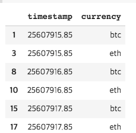
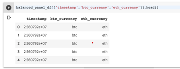

# Module4

안녕하세요 🙂 4주간의 스터디 일정을 열심히 따라와주셔서 감사합니다. 

저희가 수업에서 다룬 내용이 절대 쉽지 않은 내용이어서, 스터디 자료를 잘 소화 하셨다면, 앞으로 어떤 모델이 와도 구현해 내실 수 있으실 것입니다. 보다 자신감을 가지시고, 딥러닝 모델 구현을 시도해 보시면 좋을 것 같습니다.

혹은 스터디 내용을 따라오기에 어려우셨던 분들도, 걱정하지 않으셔도 됩니다. 저희가 다룬 내용이 쉽지 않은 내용이였기 때문에 학습에는 충분한 시간이 필요한 것 같습니다. 해당 내용을 나중에라도 복습하시면서 어려우신 부분이 있으시면 아래 메일로 질문 주시면 답변을 드리겠습니다 🙂

    email: quantic.jh@gmail.com (김종호)
    email title: "[스터디파이] ~~~”
    (가능한 메일 제목에 스터디파이를 붙혀 주시면, 제가 메일을 확인해보는데 도움이 될 것 같습니다.)

오늘 마지막 스터디 중에서 혹시 이해하기 어려웠던 부분들에 대해서 최대한 질문해 주시면 좋을 것 같습니다.

## Module4.1 Orderbook Data
#### Question1. balanced panel을 만드는 부분이 잘 이해가 되지 않았습니다.
    저희의 orderbook 데이터 모양을 보시면 currecy-time level의 데이터임을 보실 수 있습니다.
    이를 분석에서 사용하려면, 해당 데이터를 currency-time level이 아니라, time level 만으로 바꿔줄 필요가 있고요

    예를 들어서 위 그림에서 보시면, 동일한 timestamp 2개가 연달아 있지만, currency가 다른 2개의 데이터 있음을 보실수 있습니다
    이와 같이 같은 timestamp 이더라도, currency가 다르면 다른 row에 있는 모양으로 되어 있고요 

    하지만 regression, deep learning 등의 분석을 할때는 추정하고자 하는 모델이 주로 Yt = Xt + ... 의 형태로 같은 timestamp의 시점에 대한 분석을 하고 있습니다
    따라서 timestamp가 같으면 모두 같은 row로 와줘야하는데 지금은 그렇지 않은 상황입니다.
    따라서 이를 balanced panel code로 변형해준 결과는 아래와 같이, 같은 timestamp에 대해서는, 모든 currency가 같은 row에 오도록 변형해 주었습니다

#### Question2. day1에 hands on lab에서 Serieal Correlation Test에서 컬럼명을 t-1과 t+1이던데,,, t-1과 t시점의 상관관계가 아닌 t-1과 t+1의 상관관계를 확인하는건가요?
    serial correlation에 대해서 질문을 주셨는데요, 해당 column은 t-1 t가 맞습니다. 
    그리고, 해당 값을 테스트하는 목적은 과연 과거의 값이, 미래를 얼마나 설명해 주는지를 테스트하여 과거의 몇번쨰 term 까지를 끌고 와야 할지에 대해 조사해 보기 위한 목적이고요
    예를 들어서, 가장 간단한 모형을 고려해보시면 Xt= Xt-1 + Xt-2 ... Xt-N 의 몇 시점까지를 고려해야 할지 테스트 하는 용도로 쓸수 있습니다

#### Question3. bin이 quantity와 price를 같이 보기 위해 수정한 변수라는건 알겠는데, 이게 왜 그런지 이해가 안갑니다... bin에 대한 개념과 ask_strength, bin_strength개념 추가 설명 부탁드립니다.
    지금의 bin에 따른 변수들은 CS230 Project 리포트를 모사하기 위해 동일한 방식으로 만들어져 있는데요,
    Current Price를 가장 큰 bid와 가장 작은 ask 값의 average 값으로 보고
    해당 값 (현재 가격)의 10%~ -10%까지 price 범위 내에서, 0.1% 크기의 bin 200개를 만들어 주었습니다

    저희가 Orderbook 데이터를 가지고 생각해 볼수 있는것이 bid (구매 요청)가 많으면 수요가 많다는 뜻이니까 가격이 오른다는 의미로 볼수도 있고, 
    ask (판매 요청)가 많으면 가격이 떨어진다고 예측 해볼 수 있습니다

    또한 가격 범위에 따라서 bid와 ask volume을 본 이유는 현재가와 유사한 가격대에 bid, ask를 준 경우가, 훨씬 먼 가격대에 bid, ask를 준 경우보다
    영향력이 클것이라고 예상해 볼수 있기때문이고요.

    예를 들어서, 현재가가 100인데 101과 99에 판매 / 구매 요청을 한 경우와,
    현재가가 100인데 200에 판매와 1에 구매 요청을 한 경우 다른 영향이 있을 것이라고 보고, 가격 범위에 따라서 volume을 측정해 주었습니다

    여기서 사실 민감한 부분이, bin을 설정함에 따라서 discontinuous 하게 price에 따른 volume이 짤리는데
    이 부분은 smoothing을 통해서 해결할 수 있고요, bin size 자체도 중요하지만 지금의 study에서는 0.1%로 설정하였습니다

    BIN: 현재가격 *0.9/ ... / 현재가격 *0.998/ 현재가격 *0.999 / 현재가격 / 현재가격*1.001 / 현재가격 *1.002 / ... / 현재가격 *1.1

## Module4.2 CNN Encoder + RNN Time Series Prediction Model with Limit Orderbook Data
#### Question1. CNN의 출력을 LSTM으로 넣을때 어떠한 이점을 예상할수 있는것인가요?
    CNN을 통해서 Input의 Local Pattern을 찾아주는 역할을 할수 있습니다.
    일종의 Feature Extraction의 용도로 CNN을 붙힌 뒤에 RNN을 쓰고 있습니다.

## Module4.3 Stacked Autoencoders to Extract Features from Data
#### Question1. Stacked Autoencoder는 어떠한 용도로 사용될 수 있나요? 
    크게는 1. Denoising 2. feature extraction의 용도로 사용하실 수 있습니다.
    stacked autoencoder를 자세히 보시면 더 적은 정보량으로, 원레의 정보를 복구해내는 것을 보실 수 있는데요

    이를 통해서, 데이터를 압축하는 과정에서 일반적이지 않은 패턴은 지워진다고 보시면 되고요, 여러 데이터에 걸쳐 유사하게 나타나는 패턴만 살아남는다고 보시면 됩니다.
    예를 들어서, input은 200개 인데 마지막 layer의 값은 30~40개 정도이면 200개의 값이 가진 정보를 사실은 훨씬 적은 개수로 표현할 수 있게 됩니다.

    저희 마지막 모델 (day4, 5)에서는 stacked autoencoder의 encoded input을 다음 LSTM의 input으로 사용합니다
    이는, denoise & abstaction이 충분히 된 데이터를 사용하려는 목적이고요
        
## Module4.4 Final Neural Network Model

## Module4.5 Final Neural Network Model
#### Question1. LSTM대신 CNN-RNN으로도 학습할수 있다고 day4 때 공유된 문서에 되어있는데, encoder 출력시 shape이 (N,60,20) 인데 이걸 CNN으로 넣을때 2D CNN으로는 못넣는거죠?
    해당 부분에 대해 답을 드리자면, keras layer 중 reshape을 통해서 2D conv의 모양에 맞도록 channel을 추가해주시면 사용하실 수 있습니다.
    inputs에 사용해서 input 데이터를 denoising하는데 사용하였습니다.

#### Question2. 코드에서 Wavelets Denoising 실행하는 위치가 가장 좋은 위치는 어디인가요? train X를 다 만들고 나서? 아님 data 받고 preprocessing 쯤... 저번주 Wavelet Denoising 실습했는데 그때와, day5에서 실행하는 위치는 약간 다릅니다.
    저희가 이전에 다룬 모델은 Price를 denoise하면 모양이 어떻게 달라질지 보여드린 것 이고요, 이번에 wavelets은 price 쪽 (outcome)이 아니라

이 다음 스텝으로는 무엇을 해보면 좋을까요?
저희가 다루어왔던 모델들의 장점은 일단 구조가 이해되면, 개별 모델을 최상의 Performance를 내는 다른 모델로 교체 할 수 있다는 것입니다. 시간이 지남에 따라 여기에 사용 된 실제 모델은 다를 수 있지만 핵심 프레임워크는 동일하게 가져가실 수 있습니다.